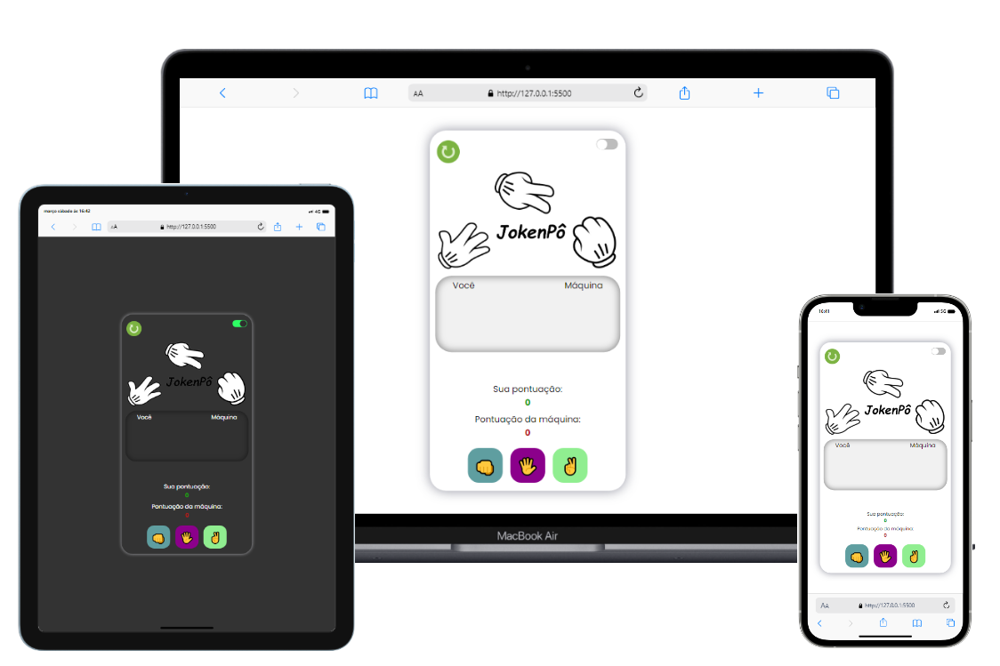

<h1 align="center">JokenPô v1.2</h1>

 Projeto desenvolvido junto a formação <a target="_blank" href="https://rodolfomori.com.br/devclub/">DevClub</a>.

## 🚀 Tecnologias

Projeto desenvolvido com as seguintes tecnologias:

  
   
  

## 💻 Projeto

Nesse jogo simples de pedra, papel e tesoura, consegui evoluir minha lógica usando Math.ramdom para sortear a escolha da máquina e tambem melhorar meu CSS e JS, codando um botão para zerar o placar e outro para deixar em modo escuro. 
Na versão 1.2 implementei uma tela de loading, uma tela que solicita o nome do usuário e uma tela que exibe o que cada um escolheu no jogo.

## 🌐 Deploy

<a target="\_blank" href="https://italosantos8012.github.io/ProjetoJokenPo/"><b>Acesse e dê seu feedback!</b></a>

## 🌎 <i>Onde me encontrar:</i>  

   

